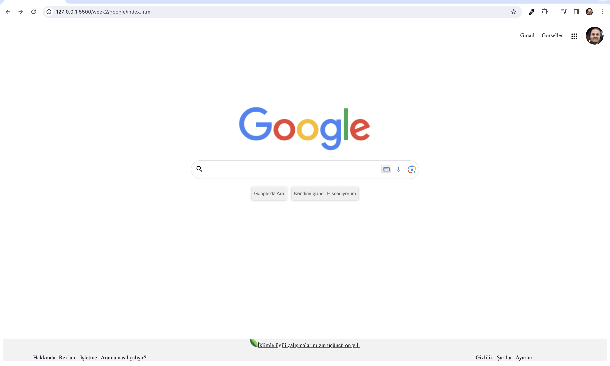

# README

## Ödev: Google Ana Sayfası'nı HTML ve CSS ile Oluşturma

### Talimatlar:

1. **İnceleme**:
   - Google Ana Sayfası'nı açın.
   - Sayfa kaynağını incelemek için sağ tıklayıp "İncele/Inspect" seçeneğini kullanın. Bu, HTML ve CSS kodunu görmenizi ve nasıl çalıştığını anlamanızı sağlar.

2. **Logo Değişikliği**:
   - Eski Google logosunu assets klasöründeki güncel logoyla değiştirin.

3. **Düzenlemeler**:

   **Üst Alan**:
   - Üstteki alanı sağ tarafa taşıyın.
   - Kendi fotoğrafınızla değiştirin.
   - Fotoğrafın kenarlarını yarıçap özelliği ile düzenleyin.

   **Arama Alanı**:
   - Arama yapılacak alanın kenarlarını da yarıçap özelliği ile düzenleyin.
   - Google Ana Sayfası'nı inceleyerek sesle arama simgesini ekleyin.
   - Arama alanında yazı yazılan yerin genişliğini 480px olarak ayarlayın.
   - Kenarlığını kaldırın.

   **Butonlar**:
   - Butonları ortaya alın.
   - Üstünden ve sağından boşluklar verin.
   - Kenarlıklarını 1px kalınlığında #f2f2f2 renginde ayarlayın.
   - Yazı tipini Arial, yazı rengini #5f6368 ve yazı boyutunu 14px olarak ayarlayın.
   - Yüksekliği 36px olarak ayarlayın.
   - Arama alanındakiyle aynı gölgeyi ekleyin.

   **Footer**:
   - Arka plan rengini #f2f2f2 olarak ayarlayın.
   - Liste noktalarını kaldırın.

4. **CSS Öğrenme**:
   - CSS dosyasında kullanılan tüm elementleri araştırın.
   - Ne işe yaradıklarını öğrenin.
   - Bu bilgileri gelecekteki projelerinizde kullanın.

### Kaynaklar:

- [CSS Tutorial](https://www.w3schools.com/css/)
- Fatih Hayrioğlu'nun CSS Sitesi: [geçersiz URL kaldırıldı]

