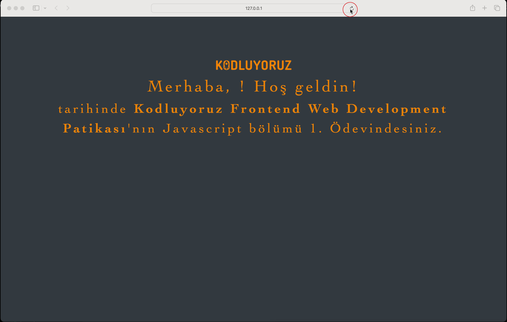

## Örnek Ekran Görüntüsü

## Nasıl Kullanılır?

1. Tarayıcınızda `index.html` dosyasını açın.
2. Sayfa yüklendiğinde bir prompt görünecek, adınızı girin.
3. Saat ve gün bilgisi ekranda gösterilecektir.

## Özellikler

- Kullanıcı dostu arayüz.
- Kullanıcının ismini büyük harflerle gösterir.
- Gün ismini Türkçe olarak gösterir.