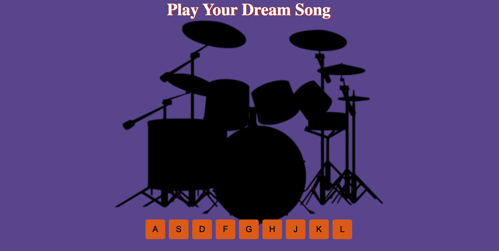

# Play Your Dream Song

Bu basit web uygulaması klavyeden harflere basıldığında farklı ses efektlerini çalar. Her harfe farklı bir ses efekti atanmıştır.

## Nasıl Kullanılır

1. Web sayfasını açın.
2. Klavyeden "A", "S", "D", "F", "G", "H", "J", "K" veya "L" tuşlarına basın.
3. İlgili harfe basıldığında, atanmış olan ses efekti çalınacaktır.